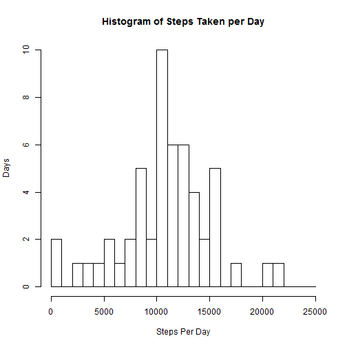
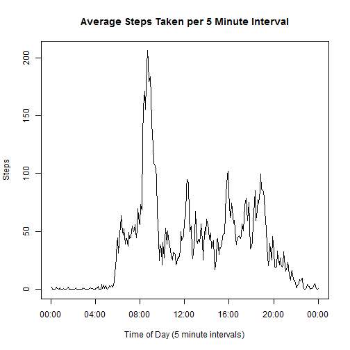
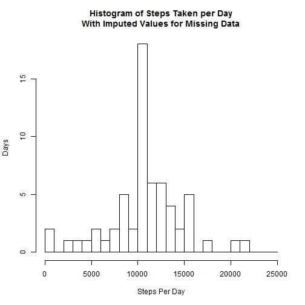
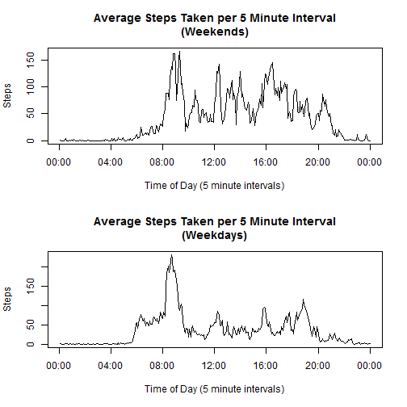

## Loading and preprocessing the data
The data are provided in the forked github repository as a CSV file (activity.csv) compressed into ZIP format (activity.zip).  First, unzip the file and read the CSV into a data frame.


```r
unzip("activity.zip")
stepdata <- read.csv("activity.csv")
str(data)
```

```
## 'data.frame':	17568 obs. of  3 variables:
##  $ steps   : int  NA NA NA NA NA NA NA NA NA NA ...
##  $ date    : Factor w/ 61 levels "2012-10-01","2012-10-02",..: 1 1 1 1 1 1 1 1 1 1 ...
##  $ interval: int  0 5 10 15 20 25 30 35 40 45 ...
```

## What is mean total number of steps taken per day?
To create a histogram of the total number of steps taken per day, fi
rst aggregate the data by day and compute the total for each day using the aggregate function.  Then create the histogram from the aggregated data.  This histogram breaks the data into breakpoints of 1000 and shows how many days the total number of steps was in between each breakpoint, up to 25,000.


```r
stepsperday <- aggregate(steps ~ as.factor(date), data=stepdata, sum)
hist(stepsperday$steps, breaks=seq(from=0, to=25000, by=1000), 
     main="Histogram of Steps Taken per Day", 
     xlab="Steps Per Day", 
     ylab="Days", 
     xlim=c(0,25000))
```

 

The mean and median of the number of steps taken per day are shown below.


```r
mean(stepsperday$steps)
```

```
## [1] 10766.19
```

```r
median(stepsperday$steps)
```

```
## [1] 10765
```
## What is the average daily activity pattern?
To create a plot of the average number of steps taken during each 5 minute interval of each day, we need to first aggregate the data by the interval and compute the mean.  An R time series object is created from the result to allow for the HHMM format of the interval numbers in the raw data and smooth the curve across time.  Then the time series plot can be generated from the time series object with time-of-day labels manually applied.


```r
stepsperinterval <- aggregate(steps ~ interval, data=stepdata, mean)
# create the time series from the result
stepsts <- as.ts(stepsperinterval$steps)
# create a line plot, define the x-axis tick marks and labels explicitly
plot(stepsts, type="l", xaxt="n", ylab="Steps", 
     xlab="Time of Day (5 minute intervals)", 
     main="Average Steps Taken per 5 Minute Interval")
axis(1, at=seq(from=0, to=288, by=48), 
     labels=c("00:00", "04:00", "08:00", "12:00", "16:00", "20:00", "00:00"))
```

 

To find the 5 minute interval which has the maximum average number of steps in the data, use the which.max() function to find the row in the data frame with the maximum step count, and output the matching interval number. 


```r
stepsperinterval[which.max(stepsperinterval$steps),][["interval"]]
```

```
## [1] 835
```

## Imputing missing values
First count the number of rows containing NA by using the complete.cases() function to find the incomplete cases and count the number of matching rows.


```r
nrow(stepdata[!complete.cases(stepdata),])
```

```
## [1] 2304
```

Create a new data frame with all of the NA values replaced by the mean value for the 5 minute interval.  First create a merged data frame between the original step data and the computed mean values of steps per interval.  Then add a new steps column with the NA values replaced by the mean values. Then create a new data frame that has the same columns at the original data from the merged data.


```r
merged <- merge(stepdata, stepsperinterval, by="interval")
merged$steps <- ifelse(is.na(merged$steps.x), merged$steps.y, merged$steps.x)
impstepdata <- data.frame(steps=merged$steps, date=merged$date, 
                          interval=merged$interval)
```

Now produce a histogram and compute the mean and median number of steps from the imputed data set similar to what was produced for the raw data set previously.


```r
impstepsperday <- aggregate(steps ~ as.factor(date), data=impstepdata, sum)
hist(impstepsperday$steps, breaks=seq(from=0, to=25000, by=1000), 
     main="Histogram of Steps Taken per Day\nWith Imputed Values for Missing Data", 
     xlab="Steps Per Day", 
     ylab="Days", 
     xlim=c(0,25000))
```

 


```r
mean(stepsperday$steps)
```

```
## [1] 10766.19
```

```r
median(stepsperday$steps)
```

```
## [1] 10765
```

## Are there differences in activity patterns between weekdays and weekends?

First add a new factor column to the imputed data set that distinguishes weekends from weekdays.


```r
impstepdata$daytype <- 
  as.factor(ifelse(weekdays(as.Date(impstepdata$date)) == "Saturday" | 
                     weekdays(as.Date(impstepdata$date)) == "Sunday", 
                   "weekend", "weekday"))
```

Now create a time series plot of the average number of steps taken on weekends and weekdays.


```r
impstepsperinterval <- aggregate(steps ~ interval + daytype, 
                                 data=impstepdata, mean)
# create separate weekend and weekday time series from the result
weekendts <- 
  as.ts(impstepsperinterval$steps[impstepsperinterval$daytype=="weekend"])
weekdayts <- 
  as.ts(impstepsperinterval$steps[impstepsperinterval$daytype=="weekday"])

# set up a 2-row, 1-column panel plot
par(mfrow=c(2,1))

# create a line plot for weekend and weekday steps, define the x-axis tick marks and labels explicitly
plot(weekendts, type="l", xaxt="n", ylab="Steps", 
     xlab="Time of Day (5 minute intervals)", 
     main="Average Steps Taken per 5 Minute Interval\n(Weekends)")
axis(1, at=seq(from=0, to=288, by=48), 
     labels=c("00:00", "04:00", "08:00", "12:00", "16:00", "20:00", "00:00"))

plot(weekdayts, type="l", xaxt="n", ylab="Steps", 
     xlab="Time of Day (5 minute intervals)", 
     main="Average Steps Taken per 5 Minute Interval\n(Weekdays)")
axis(1, at=seq(from=0, to=288, by=48), 
     labels=c("00:00", "04:00", "08:00", "12:00", "16:00", "20:00", "00:00"))
```

 

The plots show that the activity patterns differ quite a bit between weekdays and weekends.
